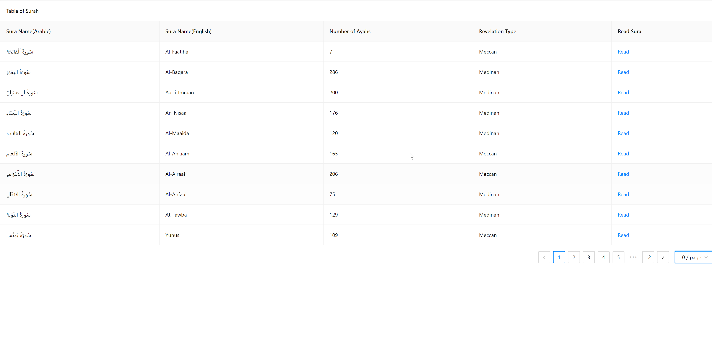
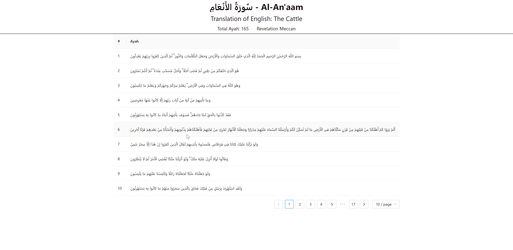

# Al Quran in Arabic

## Introduction

This is a collection of Arabic translations of the Holy Quran.
Here is the API documentation for the [Al Quran API](https://alquran.cloud/api/).

### Installation

`npm install axios antd react-router-dom`

## Usage

`npm start`

## Examples

